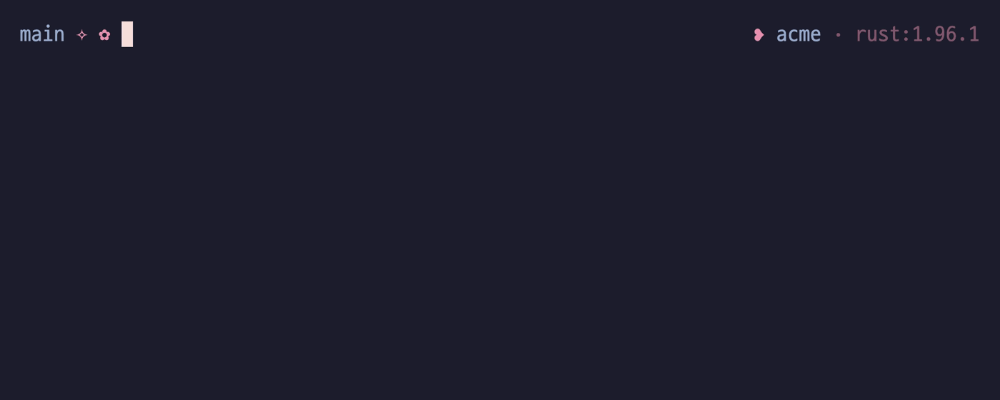

# cargo-tribute

[](https://crates.io/crates/cargo-tribute)
[](https://github.com/miniex/cargo-tribute/actions/workflows/ci.yml)

Generate a REUSE-style `LICENSES/` folder and a per-crate attribution manifest from a Cargo dependency tree, instead of hand-maintaining third-party license notices.

`cargo tribute` walks the normal-dependency closure of your workspace, resolves each crate's SPDX license expression against an accepted list, and writes:

- `LICENSES/<id>.txt` -- one canonical license text per license actually used
- `THIRD-PARTY.md` -- dependencies grouped by license, linking to the texts

It is a policy gate (fails if a dependency's license is not accepted) and, with `--check`, a staleness gate (fails if the committed output no longer matches the dependency tree) -- both suitable for CI.



## Install

```
cargo install cargo-tribute
```

Or, for a prebuilt binary via [cargo-binstall](https://github.com/cargo-bins/cargo-binstall):

```
cargo binstall cargo-tribute
```

## Usage

```
cargo tribute                     # write LICENSES/ and THIRD-PARTY.md
cargo tribute --check             # verify they are current and every license is accepted
cargo tribute --manifest-path P   # run against a specific Cargo.toml (writes at its workspace root)
cargo tribute --locked --check    # forward --locked/--offline/--frozen to cargo metadata (for CI)
cargo tribute --all-features      # forward --features/--all-features/--filter-platform too, to
                                  # attribute optional (feature-gated) or platform-specific deps
cargo tribute --help
```

## Use in CI

Fail the build when a dependency's license is not accepted, or when the committed `LICENSES/` and `THIRD-PARTY.md` drift from the dependency tree:

```yaml
# .github/workflows/licenses.yml
name: licenses
on: [push, pull_request]
jobs:
  tribute:
    runs-on: ubuntu-latest
    steps:
      - uses: actions/checkout@v4
      - run: cargo install cargo-tribute   # or: cargo binstall cargo-tribute
      - run: cargo tribute --locked --check
```

## Compared to other tools

All of these are good tools; this is where `cargo-tribute` differs (behavior as of writing -- check each project's latest docs).

|                             | cargo-tribute                              | cargo-about              | cargo-deny            | cargo-license   |
| --------------------------- | ------------------------------------------ | ------------------------ | --------------------- | --------------- |
| Attribution output          | `THIRD-PARTY.md` + REUSE `LICENSES/` folder | one file from a template | none (license linter) | lists to stdout |
| Accepted-license gate       | yes                                        | yes (config)             | yes (its focus)       | no              |
| Staleness `--check` for CI  | yes                                        | no                       | n/a                   | no              |
| Setup                       | zero-config (optional `tribute.toml`)      | template + `about.toml`  | `deny.toml`           | flags only      |

Want a broad supply-chain linter (advisories, source bans, duplicate detection)? Reach for `cargo-deny`. `cargo-tribute` stays focused on generating and gating the attribution output.

## Configuration

A `tribute.toml` in the project root overrides the defaults (all fields optional):

```toml
accepted = ["MIT", "Apache-2.0", "BSD-2-Clause", "BSD-3-Clause", "ISC", "0BSD", "Zlib", "Unlicense", "Unicode-3.0"]
manifest = "THIRD-PARTY.md"   # attribution manifest path
licenses-dir = "LICENSES"     # folder for the canonical license texts

# override a crate's license -- for crates that declare `license-file` instead of
# `license`, or whose `license` field is wrong or non-SPDX. Repeatable.
[[clarify]]
name = "ring"
version = "0.17.8"            # optional semver req (like Cargo); omit to match any version
expression = "MIT AND ISC AND OpenSSL"
```

## How a license is chosen

Each crate's SPDX expression is evaluated against `accepted` (which is also the OR preference order): for `A OR B` it picks the preferred accepted license, for `A AND B` it keeps both. Legacy `/`-separated expressions (`MIT/Apache-2.0`) are accepted. A crate whose expression cannot be satisfied from the accepted set is a hard error.

Only normal (runtime) dependencies are attributed -- dev- and build-dependencies are skipped. By default `cargo metadata` resolves the default feature set, so optional (feature-gated) dependencies are not attributed unless you enable them with `--features`/`--all-features`. Canonical license texts are bundled under `assets/licenses/`; the common permissive set ships, and using a license without a bundled text errors with the file to add.

A crate with no `license` field (it declares `license-file` instead), or a wrong or non-SPDX one, is a hard error until you give it an SPDX expression with a `[[clarify]]` entry; the clarified expression then flows through the same accepted-set policy.

## License

Licensed under either of [Apache License, Version 2.0](LICENSE-APACHE) or [MIT license](LICENSE-MIT) at your option.
